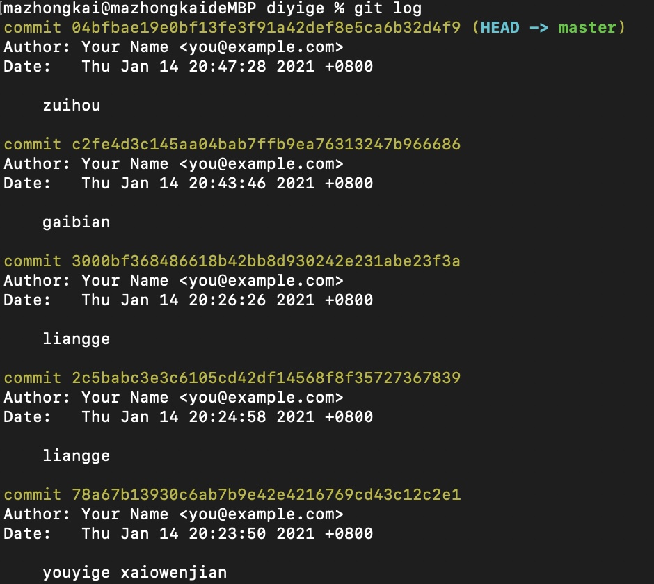

git status 随时查看工作区状态

可以让我们时刻掌握仓库当前的状态

git diff 查看difference

知道不同之后可以放心提交到仓库：和之前一样

第一步 git add xxx.txt

第二步 git commit -m"add xxx"

小结：

- 要随时掌握工作区的状态，使用git status命令。
- 如果git status告诉你有文件被修改过，用git diff可以查看修改内容。

版本回退：

可以使用 git log 来查看历史记录。

git log 命令显示从最近到最远的提交日志，

如果嫌输出信息太多太乱，可以 git log --pretty=oneline

输出的信息包含一长串数字（十六进制)就是commit id （版本号）

查看文本里面的具体内容 ： cat xxx.txt

可以启动时光穿梭机来回退到上一个版本，首先得知道当前的版本，用HEAD表示当前版本，上一个版本就是HEAD^，上上个版本就是HEAD^^，当然往上继续写版本可以改成HEAD~xxx。

使用 git reset --hard HEAD^ 回退到上一个版本

还可以使用 git reset --hard  xxx(版本号） 此方法是在没有关掉命令行窗口的前提下完成的。

版本号没必要写全 写前几位就好了 git会自动查找

回退之后，当关闭了电脑想要回到未来的某一个版本，需要使用 git  reflog来查找之前文件的版本号commit id

再使用 git reset --hard xxx

小结：

- HEAD指向的版本就是当前版本，因此，Git允许我们在版本的历史之间穿梭，使用命令git reset --hard commit_id。
- 穿梭前，用git log可以查看提交历史，以便确定要回退到哪个版本。
- 要重返未来，用git reflog查看命令历史，以便确定要回到未来的哪个版本。
